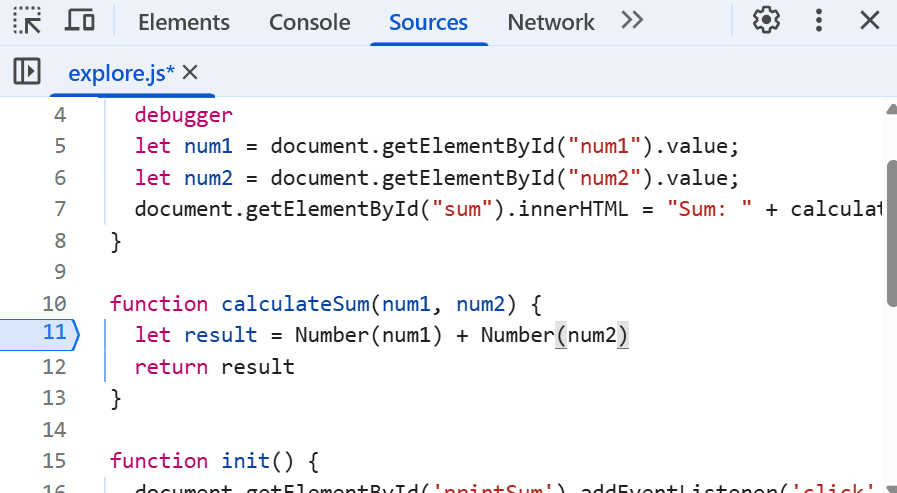

1. The error was that `num1` and `num2` were strings and not converted into numeric values, so a concatenation happened instead of a numeric addition.
2. I would fix this by casting `num1` and `num2` to be a `Number`. If the user inputs something that can not be casted to be a numerical value, additional error handling would be necessary. 